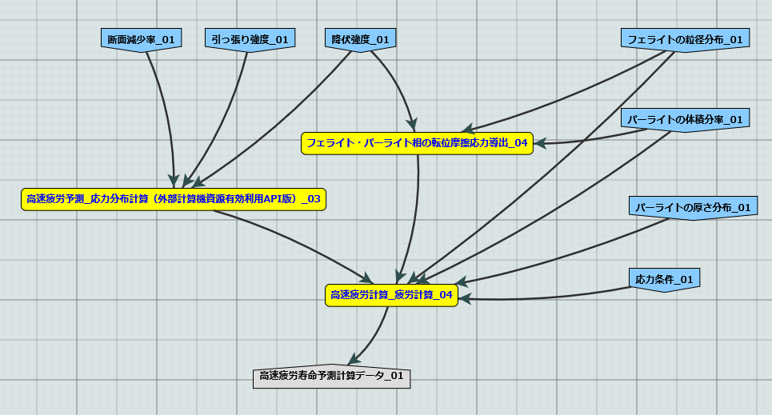

==========
はじめに
==========

MIntには、ワークフローを構成するモジュール内の一部分の処理を、MIntの計算ノード以外の「外部計算機」に行わせる機能がある。本機能によって、ユーザには下記に挙げる利点がある。

* 部外秘プログラムの使用
* 部外秘データの使用
* 特殊構成 (MIntの計算ノードでは対応できない) の計算機を使用できる
* 商用ソフトの使用 (MIntの計算ノードにも商用ソフトがインストールされているが、ライセンスの規定上、ほとんどの場合NIMS外からは利用できない)

外部計算資源の利用に際しては、MInt、外部計算機の双方が後述のセキュリティ水準を満たす必要がある。
また、両者間のネットワークは常時SSLで暗号化される。

外部計算資源利用には、SSHとWebAPIというふたつの方式がある。
前者はMIntから外部計算機へSSHで必要なデータとコマンドをプッシュする方式である。
単純で、外部計算を遅延なく開始できる利点があるが、外部計算機側でMIntに対しSSHのポートを開放してプッシュを受け入れる必要がある点は、特に企業ユーザではハードルが高いことが想定される。
これに対し、後者は数分間隔で外部計算機側からMIntにWebAPI(https)でポーリングし、処理すべき案件が存在した場合は、必要なデータとコマンドがプルされる方式である。
この方式では外部計算機側にポート開放の必要が無いが、外部計算開始までにポーリング間隔に相当する遅延が生じる。

MIntが収集する情報は、ワークフローのラン(run)ごとの各モジュールの入出力ポートの情報のみであるため、モジュールの内部で「外注」をさせる本機能で、モジュールと外部計算機間で送受信される情報は収集対象外である。
SSHでは.authorized_keysの設定で外部計算機がMIntに実行を認めるコマンドを固定できる。
WebAPI方式では、外部計算機は自分でコマンドを実行する。
また、もちろん外部計算が返却するデータは十分に限定することができる。

上記の機構によって、安全な外部計算が実現される。下記の各章で、具体的な実装方法について記す。

======
概要
======

前提条件
====

外部計算資源を利用するにあたっては、下記が前提となる。

1. 産学共同研究契約、MIntシステム利用規定、その他のMInt利用に関わる契約・規定の各条項を遵守すること。
2. MInt提供側は、下記のセキュリティ対策を実施すること。

    * 第三者によるMIntのセキュリティ分析・セキュリティリスク診断を実施し、リストを避ける設計を維持すること。
    * MIntを構成するサーバのOS・ミドルウェア・ライブラリ等に対し、定期的にJVN脆弱性情報を確認し、必要なアップデートを実施すること。
    * 不正アクセス監視やネットワーク負荷監視を実施すること。
3. 外部計算資源の提供側は、外部計算機として利用されるコンピュータに対し、十分なセキュリティ対策を実施すること。継続的に利用する場合には、定期的に対策状況を確認し、セキュリティレベルを維持すること。
4. 不明な点は、協議のうえで決定すること。

.. raw:: latex

    \newpage

利用イメージ
====

MIntユーザが外部計算資源を利用するイメージを下図に示す。

* MIntはNIMS構内のDMZ(物理的にはNIMS構内のサーバ室に存在するが、ネットワーク的には機構内LANとインターネットの双方からファイアウォールで切り離された領域)に存在する。
* ユーザはMInt上に、外部計算を利用するモジュールを含んだワークフローを持つ。当該モジュールやワークフローの参照・実行権限は自機関内などに限定できる。
* ユーザは当該ワークフローに必要な入力を与えて実行する。
* MIntはモジュールを順次実行する。
* 各モジュールは定義された処理を実行する。外部計算を利用するモジュールでは、一部の処理が外部計算機に受け渡される。
* 外部計算機は処理の過程で、MIntに置けないデータやプログラムにアクセスできる。これらへのアクセスを外部計算機での処理の中で完結させることで、安全な利用が可能となる。
* モジュールは外部計算機から返送された結果を受け取り、定義されていれば必要な後処理を行ってモジュールとしての出力を行う。
* MIntはワークフローの残りの部分を実行し、ユーザに最終結果を出力する。
.. raw:: html

   

  外部計算機資源利用機能を活用した計算のデータの流れ

.. figure:: images/image_for_use.eps
  :scale: 70%
  :align: center

  外部計算機資源利用機能を活用した計算のデータの流れ

.. raw:: latex

    \newpage

アクセス方式
==========

MIntと外部計算機資源の間のアクセスは、下記がサポートされている。

* SSH方式
    + MInt側からSSHで外部計算機にアクセスし、必要なデータとコマンドをプッシュし、コマンドを発行し、結果を得る。
    + 外部計算機側SSHサーバのポート(TCP/22以外でも可)のインバウンドアクセスの開放が必要である。
* WebAPI方式
    + 外部計算機側からMIntのAPIサーバにポーリングを行い、要処理案件の有無を確認する。ポーリング間隔は数分程度を想定している。案件があれば、外部計算機が必要なデータとコマンドをプルし、自らコマンドを実行し、APIで結果を送信する。
    + MIntのAPIサーバへのhttps(TCP/443)のアウトバウンドアクセスの許可が必要である。

送受信内容
---------

* SSH方式

     * ファイル

          + 非圧縮(内部でrsync -avを利用)
          + サイズ無制限
     * コマンドなどの文字列

          + 非圧縮
          + Base64エンコード無し
* WebAPI方式

     * ファイル

          + 非圧縮
          + Base64エンコード
          + 2 GiB未満
     * コマンド列などの文字列

          + 非圧縮, Base64エンコード無し)

(注) 外部計算を利用するモジュールでは、外部計算の前後にモジュール内でも処理が行える。事前に必要な入力データを生成したり、事後にモジュールとしての結果を生成する処理などが想定される。この時送り込まれる該当予測モジュールに関係ないいかなるデータ、ファイルもMIntシステムは感知しないし、GPDBなどへの登録もしないが、ストレージには残る。必要であれば関連スクリプト中で最後に削除の手続きを実施することを推奨する。

使用するリポジトリ
==================

外部計算資源の利用開始に必要な資材は、GitHub 上のリポジトリ [#whatisRepository]_ に用意されている。ユーザはこれらを外部計算機に配置し、プログラム実行に必要なコマンド、ファイル送受信の手続きを設定、埋め込むだけでよい。

- misrc_remote_workflow 

    - 主に外部計算機側で実行されるスクリプトのサンプルが登録されている。 
- misrc_distributed_computing_assist.api 

    - WebAPI方式のためのシステム構築用のプログラム、サンプルが登録されている。 
    - MIntシステム側で使用するプログラムは「debug/mi-system-side」にある。
    - 外部計算機側で使用するプログラムは「debug/remote-side」にある。 

展開したファイルの扱い
----------------------

リポジトリからダウンロードしたファイル類には、以下の制約を課すものとする。

1. 一部のファイル [#whatisOtherthanfiles]_ を除いてライセンスは「★★★」が適用され、ソースコードの著作権はMIntが保持する。
2. ユーザによる改変によって外部計算機資源の有効利用のワークフローが動作しなくなってもMInt側(★★)は責任を追わない。
3. 外部計算機資源側独自の改変を1. 以外のスクリプトに適用したい場合は、MInt(★★)と個別に協議する。

.. [#whatisRepository] 本機能を実現する資材などを格納したサーバのこと。GitHubを利用しているが、MIntがアカウントを発行したユーザのみダウンロードが可能である。アップロードはユーザには通常許可していない。
.. [#whatisOtherthanfiles] misrc_remote_workflow/scripts以下にある、SSH方式でのexecute_remote-side_program_ssh.sample.shを複製したファイルと、WebAPI方式でのexecute_remote-side_program_api.sample.shおよびこれらを複製したスクリプトファイルを指す。

実行されるコマンド
===================

SSH方式の場合、リポジトリにあるコマンドしか外部計算機上では実行しない。その場所も事前に取り決めた場所となる。WebAPI方式も同様である。(★★)

データの帰属に関して
===================
★★★★★★

ユーザアカウント
====================

外部計算機側、MInt側の双方にアカウントが必要となる。外部計算機側はそれぞれの組織内で決定し、MIntシステム側はこの機能を利用する組織がMIntシステム側へアカウント作成の依頼を行う。双方またはどちらかにすでにアカウントがある場合はそれを利用することになる。

ワークフローの廃止
================

本機能を利用したワークフローを廃止する際は、廃止届を提出する。廃止されたワークフローはMIntシステムで「無効」のステータスとなり実行できなくなる。

=================
SSH方式での利用方法
=================

作業概要
--------

* MInt側

    + 外部計算専用の計算ノードの設置
    + 外部計算用モジュールの作成 (前項で用意した専用計算ノードを指定して実行可能)
    + モジュールおよび専用計算ノードのSSH設定(公開鍵認証を使い、パスフレーズ無しで接続できることが望ましい)
* 外部計算機側

    + Linux計算機の設置 (Macも可。WindowsはSSH接続に問題が生じやすいため非推奨だが動作は可能)
    + 必要資材の展開
    + 実行プログラムのパス・パラメータ・秘匿データの配置などの設定

MInt側
------

専用計算ノードで以下の動作が行われるよう、専用モジュールが定義するプログラムを実行する。

* パラメータ類を外部計算機へ送信（外部計算機側にあるパラメータまたはファイルの指定も可）
* 外部計算機でプログラムの実行
* 結果ファイルの取得

外部計算機側
-----------

外部計算機資源側計算機では、必要なファイルの配置が主な手順である。

* リポジトリから取得した資材の展開
* 実行プログラムパスの調整
* 秘匿データ（ある場合）の指定ディレクトリへの配置

.. mermaid::
   :caption: SSH実行のイメージ
   :align: center

   graph LR;

   subgraph NIMS所外
     input3[\秘匿データ/]
     module21[専用プログラム実行]
     module22[データ返却]
   end
   subgraph MIntシステム
     subgraph ワークフロー
       input1[\入力/]
       module11[SSH実行開始]
       module12[SSHデータ受け取り]
       module13[計算]
       output1[/出力\]
     end
   end

   input1-->module11
   module11-->module12
   module12-->module13
   module13-->output1
   input3-->module21
   module11--SSH経由-->module21
   module21-->module22
   module22--SSH経由-->module12

サンプルワークフロー
------------------

この方式では、以下のようなシステムで動作サンプルが用意されている。

.. figure:: images/remote_execution_image.eps
  :scale: 70%
  :align: center

  遠隔実行のイメージ

.. raw:: html

   

  遠隔実行のイメージ

モジュール(Abaqus2017)と、外部計算用の計算ノード(計算ノード２)を用意することで、外部計算資源を利用したワークフローが実行可能となる。またAbaqus2017と謳ってはいるが実行するプログラムはこれに限らず、様々なコマンド、プログラム、アプリケーションを実行することが可能なように作られている。

.. figure:: images/workflow_with_sshmodule.png
  :scale: 80%
  :align: center

  動作検証用のワークフロー

※赤枠の部分が遠隔実行の行われるモジュールである。

.. raw:: latex

   \newpage

外部計算機でのディレクトリ
-----------------------

外部計算機のディレクトリ構造は下記の通りである。インストール方法は後述する。

* ユーザーディレクトリ

.. code-block:: none
  
  ~/ユーザーディレクトリ
    + remote_workflow
      + scripts
        + input_data

* ワーキングディレクトリ

.. code-block:: none

  /tmp/<uuid>

コマンドの流れ
--------------

ワークフローの該当モジュールから外部計算機のコマンドが実行されるまでの流れを下記に示す。

.. mermaid::
   :caption: SSH接続経由によるコマンド実行の流れ
   :align: center

   sequenceDiagram;

     participant A as モジュール
     participant B as プログラム（Ａ）
     participant C as プログラム（Ｂ）
     participant D as プログラム（Ｃ）
     participant E as プログラム（Ｄ）

     Note over A,C : NIMS機構内
     Note over D,E : 外部計算機資源内

     A->>B:モジュールが実行
     B->>C:（Ａ）が実行
     C->>D:（Ｂ）がSSH経由で外部計算機の（Ｃ）を実行
     D->>E:（Ｃ）が実行

* ワークフロー : 予測モジュール

    + MIntシステムが実行する予測モジュール
    + （Ａ）を実行する
* プログラム（Ａ）: kousoku_abaqus_ssh_version2.sh（サンプル用）

    + MIntの予測モジュールが実行する。
    + モジュールごとに用意する。名前は任意。:ref:`how_to_use` で説明する編集を行う。
    + モジュール定形の処理などを行い、（Ｂ）を実行する。
        - （Ｂ）の名前は固定である。
* プログラム（Ｂ）: execute_remote_command.sample.sh

    + （Ａ）から実行された後、外部計算機実行のための準備を行い、SSH経由で（Ｃ）を実行する。
    + 名前は固定である。このプログラムが外部計算機資源との通信を行う。
    + :ref:`how_to_use` で説明する編集を行う。
        - 送信するファイルはパラメータとして記述。
        - （Ｃ）の名前は固定である。
    + 受信するファイルは外部計算機資源上の計算用ディレクトリ [#calc_dir1]_ のファイル全部。
* プログラム（Ｃ）: execute_remote-side_program_ssh.sh

    + （Ｂ）からSSHで実行される。
    + 外部計算機で実行されるプログラムはここへシェルスクリプトとして記述する。
    + インストール時はexecute_remote-side_program_ssh.sample.sh [#sample_name1]_ となっている。
* プログラム（Ｄ）: remote-side_scripts
    + （Ｄ）から実行されるようになっており、いくつかのスクリプトを実行するよう構成されている。
    + サンプル専用であり、必ず使うものではない。（Ｃ）に依存する。

.. [#calc_dir1] 外部計算機では、計算は/tmpなどに作成した一時ディレクトリで実行される。
.. [#sample_name1] 本システムでは、MIntは「execute_remote_command.sample.sh」を実行し、外部計算機で実行を行うプログラムとして「execute_remote-side_program_ssh.sh」を呼び出す。外部計算機側ではインストール後にこのファイル（インストール直後は、execute_remote_program_ssh.sample.shと言う名前）を必要に応じて編集して使用することで、別なコマンドを記述することが可能になっている。

MIntへ送受信されるデータ
--------------------------------

MIntへ送受信されるデータは、「execute_remote_command.sample.sh」に記述しておく。

* MIntから外部計算機への送信

    + 「execute_remote_command.sample.sh」にパラメータとして記述したファイル。（モジュール内）
* 外部計算機からMIntへの返信

    + 計算結果としての出力ファイル。
        - 計算専用ディレクトリを作成して計算され、そのディレクトリ以下のファイルは全て (★★)
        - このディレクトリでの計算は、「execute_remote-side_program_ssh.sh」で行われるので、返信しないファイルはスクリプト終了前に削除されるようスクリプトを構成する。

.. raw:: latex

    \newpage

=================
WebAPI方式での利用方法
=================

概要
----

WebAPI方式では、MIntと外部計算機を仲介するAPIサーバを立て、MInt側と外部計算機側の双方がAPI(https通信)で外部計算を実現するシステムである。
この場合、MIn外部計算機資源側、MIntシステム側（予測モジュール）は計算工程の随所で定期的に通信する必要がある（ポーリング）ので、ポーリング方式とも言う。
SSHの場合と比べて外部計算機資源の利用および実行のための手続きが多くなり、用意するプログラムも複雑になる。

.. raw:: latex

    \newpage

実行のイメージ
---------------

この方式では以下のようなシステムを想定している。 

.. figure:: images/remote_execution_image_api.eps
  :scale: 70%
  :align: center

  WebAPI方式を利用した外部計算機資源の利用イメージ

.. raw:: html

   

  WebAPI方式を利用した外部計算機資源の利用イメージ

.. raw:: latex

    \newpage

WebAPI方式の流れ
----------------------------

この方式でのWebAPI方式のフロー概要。

.. mermaid::
   :caption: WebAPI方式の流れ
   :align: center

   sequenceDiagram;

   participant A as MIntシステム （NIMS内）
   participant B as WebAPI (NIMS内)
   participant C as WebAPI方式 （ユーザー側）
   participant D as ユーザープログラム （ユーザー側）

   C->>B:リクエスト
     alt 計算が存在しない
       B->>C:ありません
       C -->> C:リクエスト継続
     else 計算が存在する
       A->>B:計算要求
       C->>B:リクエスト
       B->>C:存在する
       C->>B:情報取得リクエスト
       alt 計算実行
         B->>C:パラメータ送付、コマンドライン送付
         C->>D:プログラム実行
         alt プログラム実行
           D -->> D:プログラム実行中
         else プログラム終了
           D -->> C:プログラム終了
         end
         C->>B:計算終了通知
       else no seq
       end
       B->>C:計算結果の返却要求
       C->>B:計算結果の返却応答
       B->>A:ジョブの終了要求
     end

.. raw:: latex

    \newpage

システム要件
---------------

この方式における必要な条件を記す。おもに外部計算機資源側の条件となる。

* 双方で設定必要な事項

   + 実行可能な計算またはプログラム
   + 送受信するファイル
   + この情報をAPIがワークフローから遠隔計算機へ、遠隔計算機からワークフローへと受け渡す。遠隔計算機へはコマンドとパラメータ。ワークフローへは計算結果などのファイルである。
* MIntシステム側

   + 外部計算機資源有効利用用の計算ノードを設置してある。(以下専用計算機または専用ノードとする）
   + 外部計算機資源有効利用モジュールを作成
   + このモジュールは専用計算機を指定して計算を行うよう実装する。
   + WebAPI用プログラムを実行する。MIntシステムへ到達可能ならどこでもよい。
   + このAPIプログラムはモジュールごとに専用の設定を必要とする。
   + このモジュールはこのAPIとだけ通信する。
* 外部計算機資源側

   + NIMS所外にあって、httpsで本APIへ到達可能なネットワーク設定の場所にあること。
   + 本APIと計算を行うためのWebAPI方式用プログラムのサンプルをpythonで用意した。ほとんどの場合このサンプルプログラムで事足りる。
   + 用意する計算機はLinuxが望ましいが、サンプルを利用する場合pythonが実行可能なPCなら何でもよい。
   + 必要な資材を取得、展開。
   + 資材をローカライズ（プログラム等を環境に合わせて編集）

.. raw:: latex

    \newpage

用意されているサンプルワークフロー
----------------------------------

下記イメージの動作検証用サンプルワークフローを用意してある。

   検証用ワークフロー

※赤枠の部分が外部計算機資源を利用するモジュールである。

.. raw:: latex

    \newpage

MIntシステムでのディレクトリ
-----------------------------

MIntシステム側のディレクトリ構造は以下のようになっている。

* ユーザーディレクトリ

.. code-block:: none

   ~/misystemディレクトリ
    + remote_workflow
      + scripts
    + misrc_distributed_computing_assist_api
      + debug
        + mi-system-side
     
* ワーキングディレクトリ
    + 複雑なので省略する。

外部計算機資源でのディレクトリ
----------------------------

外部計算機資源のディレクトリ構造は以下のようになっている。インストール方法については後述する。

* ユーザーディレクトリ

.. code-block:: none
  
  ~/ユーザーディレクトリ
    + remote_workflow
      + scripts
        + input_data
    + misrc_distributed_computing_assist_api
      + debug
        + remote-side

* ワーキングディレクトリ

.. code-block:: none

  /tmp/<uuid>

.. raw:: latex

    \newpage

外部計算機でMIntシステムから実行されるプログラム
------------------------------------------------

ワークフローの該当モジュールからAPI経由で外部計算機のコマンドが実行されるまでの流れを下記に示す。

.. mermaid::
   :caption: WebAPI方式でのコマンドの流れ
   :align: center

   sequenceDiagram;

     participant A as モジュール
     participant B as プログラム（Ａ）
     participant C as API
     participant D as プログラム（Ｃ）
     participant E as プログラム（Ｄ）

     Note over A,C : NIMS機構内
     Note over D,E : 外部計算機資源内

     A->>B:モジュールが実行
     B->>C:（Ａ）がhttps経由でAPI発行
     D->>C:（Ｃ）がhttps経由でAPI発行
     D->>E:（Ｃ）が実行

本システムでは、MIntシステムのAPIに設定したプログラムを外部計算機での実行に使用する。
サンプルワークフローでは、「execute_remote-side_program_api.sh」となっている。
外部計算機側ではインストール後にこのファイル（インストール直後は、execute_remote_program_api.sample.shと言う名前）を必要に応じて編集して使用する。

MIntシステムで送受信されるデータ
--------------------------------

MIntシステムで送受信されるデータは、MIntシステム側のAPIと通信するモジュールの実行ファイルであらかじめ決め置く。APIにはその情報によって外部計算機資源とデータのやりとりをする。
この情報に必要なファイルのみ設定することで、それ以外のファイルの存在をMIntシステム側で感知できず、したがって不要なファイルのやりとりは発生せず、秘匿データなどの保護が可能となる。

.. _how_to_use:

========
使用方法
========

インストールおよびプログラムの準備など説明する。SSH方式、WebAPI方式のそれぞれの準備から実行までを記述する。

本システムの利用者はMIntシステムのアカウントは既に発行済であるものとし、その手順は記載しない。またgitコマンドなどの利用方法はシステム管理者などに問い合わせることとし、ここではそれらのインストール、詳細な使用方法は言及しない。

手順は以下のようになっている。

1. 事前に決定しておく事項の列挙
2. 外部計算機側の準備
3. Intシステム側の準備
4. 専用予測モジュールの準備
5. ワークフローの準備
6. WebAPI方式の場合の準備

.. _before_descide_items:

使用開始前に
============

事前決定事項の列挙
------------------

事前に決定しておく項目は以下の通り。

1. 方式の決定

    + 害撫計算機資源側実行ユーザーの決定または無い場合は作成。
    + MIntシステム側ユーザーの決定または無い場合は作成。

         - API方式の場合設定されているAPIトークンの取得。
    + 方式毎の認証情報の取り決め
2. 解析、計算の決定
 
    + MIntシステム側で使用可能で、必要なモジュールの選定。
    + 外部計算機資源側で1.を考慮にいれ、用意する必要のある手順の検討。
3. 実行するプログラム

    + 2. の見当の結果、外部計算機資源側で実行するプログラム及び必要なパラメータの調査。
    + MIntシステムから最初に呼び出されるスクリプトの決定。
4. misrc_remote_workflowリポジトリの展開場所

    + クライアント側のプログラム実行場所として使用する。
    + 実行プログラム用のテンプレートなどが入っているのでこれを利用する。
5. misrc_distributed_computing_assist_apiリポジトリの展開場所

    + WebAPI方式の場合に必要。
    + debug/remote-side/mi-system-reote.pyがWebAPI方式プログラムで、これを実行しておく。

SSH方式の認証情報
-------------------

SSH方式では基本的にパスワードなし接続とするため、RSA/TSAどちらかの公開鍵暗号ファイルをMIntシステム側に設定する必要がある。

1. RSA方式の公開鍵暗号ファイルの作成方法にしたがい公開鍵暗号ファイルを外部計算機資源側の実行ユーザーで作成する。

.. code::
   $ ssh-keygen -t rsa
   Generating public/private rsa key pair.
   Enter file in which to save the key (/home/misystem/.ssh/id_rsa):
   Enter passphrase (empty for no passphrase): 
   Enter same passphrase again: 
   Your identification has been saved in /home/misystem/.ssh/id_test_rsa.
   Your public key has been saved in /home/misystem/.ssh/id_test_rsa.pub.
   The key fingerprint is:
   fd:f6:ab:3c:55:8d:f5:4d:52:60:27:2b:9b:b8:49:fb misystem@zabbix-server
   The key's randomart image is:
   +--[ RSA 2048]----+
   |              +oo|
   |             ..+o|
   |            . .=+|
   |         . . +. =|
   |        S + o  . |
   |         . =  .  |
   |          + o.   |
   |           +..   |
   |            Eoo. |
   +-----------------+

* すべてエンターのみとする。
* 既に存在している場合はそれを使う。

2. 作成された「~/.ssh/id_rsa.pub」ファイルをMIntシステム担当者まで送付する。

WebAPI方式の認証情報
--------------------
WebAPI方式では公開鍵ではなく、事前に取り決める「サイト名（半角英数字。文字数制限なし）」と「APIアクセストークン(MIntシステムで作成するユーザーアカウントに設定される)」を用意しておく。

* サイト名：他の外部系さ機資源の有効利用で使用していない名称であること。
* APIアクセストークン：MIntシステムに登録されている外部計算機資源側に属する人のアカウントおよびそこに設定されているAPIトークン。

外部計算機資源側の準備
----------------------

1. :ref:`before_descide_items` の 4. と 5. で決定した場所へリポジトリを展開する
2. :ref:`before_descide_items` の 3. で決定したスクリプトを作成する。

MIntシステム側の準備
--------------------

1. 実装調査書の作成

    + :ref:`before_descide_items` 2.の情報（スクリプトと送受信するパラメータ）を盛り込む。

専用予測モジュールの準備
--------------------------

1. 専用予測モジュールの作成

    + どちらの方式を採用するか。
    + 1.の情報を盛り込んだ予測モジュールを作成する。
2. ワークフローの準備

    + 2. で作成した予測モジュールを使用するワークフローを作成する。
3. SSHの場合

    + MInt側からクライアント計算機へのSSHログインのための情報
    + 鍵暗号化方式によるパスワードなし、パスフレーズなし接続が望ましい。
4. WebAPI方式の場合

    + WebAPI方式の場合は不特定多数の利用者とAPIプログラムを共有するので、認証などの設定事項をMIntシステム側に事前設定しておく。

WebAPI方式の場合の設定事項
------------------------------
WebAPI方式では、SSHとはまた違う認証情報が必要なため、それらを記述する。以下の情報は外部計算機側でWebAPIプログラムを実行する際に必要である。

* APIトークン

    + 本方式ではMIntシステムのAPI認証システムを使用しているので、そのトークンが必要となる。NIMS側に問い合わせて取得しておく。
* ホスト情報

    + MIntシステム側でAPI問い合わせに対する個別の識別を行うためにサイト情報（文字列として区別できれば何でもよい）が必要である。
* MIntシステムのURL

    + MIntシステムのURL（エンドポイントは不要）が必要である。NIMS側に問い合わせておく。

.. raw:: latex

    \newpage

SSH方式
=======

SSH方式での準備を決定事項にしたがって実施する。

外部計算機資源側
-----------------

1. misrc_remote_workflowリポジトリを以下の手順で作成しておく。

  .. code::
  
     $ git clone https://gitlab.mintsys.jp/midev/misrc_remote_workflow
     $ cd misrc_remote_workflow
     $ ls
     README.md  documents  inventories  misrc_remote_workflow.json  modulesxml  sample_data  scripts
     $ cd scripts
     $ ls
     abaqus                                     execute_remote_command.sample.sh  kousoku_abaqus_ssh.sh
     create_inputdata.py                        input_data                        kousoku_abaqus_ssh_version2.py
     execute_remote-side_program_api.sample.sh  kousoku_abaqus_api_version2.py    kousoku_abaqus_ssh_version2.sh
     execute_remote-side_program_ssh.sample.sh  kousoku_abaqus_api_version2.sh    remote-side_scripts
     execute_remote_command.sample.py           kousoku_abaqus_http.py

2. 外部計算機資源側で実行するスクリプトがあれば、「remote-side_scripts」に配置する。
3. MIntシステム側から外部計算機資源側へSSHログインして最初に実行されるプログラム名は「execute_remote-side_program_ssh.sh」である。
このため「execute_remote-side_program_ssh.sample.sh」を「execute_remote-side_program_ssh.sh」にコピーするか、「「execute_remote-side_program_ssh.sh」」を独自に作成し、2.などの実行および必要な手順をスクリプト化しておく。

MIntシステム側
------------------

1. ワークフローを作成する場合に「misrc_remote_workflow/scripts/execute_remote_command.sample.sh」を必要な名称に変更し、内容を参考にしてSSH 経由実行が可能なように編集し、ワークフローから実行させる。
2. 1.を実行可能な通常どおりのワークフローを作成する。作成方法に差は無い。

WebAPI方式
==============

外部計算機資源側
-----------------

1. misrc_distributed_computing_assist_apiリポジトリを以下の手順で作成しておく。

  .. code::
  
     $ git clone https://gitlab.mintsys.jp/midev/misrc_distributed_computing_assist_api
     $ cd misrc_distributed_computing_assist_api
     $ ls
     README.md  logging.cfg     mi_dicomapi_infomations.py           syslogs
     debug      mi_dicomapi.py  mi_distributed_computing_assist.ini
     $ cd debug
     $ ls
     api_status.py  api_status_gui.py  api_status_gui.pyc  mi-system-side  remote-side
     $ cd remote-side
     $ ls
     api-debug.py  debug_gui.py  mi-system-remote.py

2. my-system-remote.pyを実行しておく。

  .. code::
  
     $ python mi-system-remote.py rme-u-tokyo https://nims.mintsys.jp <API token>

MIntシステム側
--------------

1. misrc_distributed_computing_assist_apiリポジトリを展開。
2. mi_dicomapi.pyが本体であるが、まだ動作させてなければ、mi_distributed_computing_assist.iniに外部計算機資源側の設定を実施する。動作させていたら、設定の再読み込みを実施する。

  .. code::

     $ python
     >>> import requests
     >>> session = requests.Session()
     >>> ret = session.post("https://nims.mintsys.jp/reload-ini")
     >>>

3. まだ動作していなかったら、動作させて待ち受け状態にしておく。

  .. code::

     $ python mi_dicomapi.py

ワークフローについて
====================

外部計算機資源利用を行うワークフローの作成の仕方を記述する。

共通事項
--------

SSH方式とWebAPI方式の両方に共通する事項である。

* 予測モジュール

    - pbsNodeGroup設定で、ssh-node01を設定する。他の計算機では外へアクセスすることができないため。
    - pbsQueueなどCPU数などは指定できない。
    - 外部計算機資源側で別途Torqueなどのバッチジョブシステムに依存する。

SSH方式
-------

予測モジュールの実行プログラムから misrc_remote_workflow/scripts/execute_remote_command.sample.sh またはこのファイルを専用に別名コピー編集したものを必要なパラメータとともに実行するように構成する。

WebAPI方式
----------

予測モジュールの実行プログラム内で、misrc_distributed_computing_assist_api/debug/mi-system-side/mi-system-wf.py を必要なパラメータとともに実行するように構成する。

.. _sample:

サンプル
--------

misrc_remote_workflowリポジトリにある、sample_dataディレクトリにテストで使用したワークフロー実行用のサンプルファイルが用意されている。これを利用してワークフローおよび外部計算機側の動作の実行テストが可能である。

また、misrc_remote_workflow/scriptsにこの時の予測モジュール実行プログラムがある。これを参考に別な予測モジュール実行プログラムを作成することが可能である。

* kousoku_abaqus_api_version2.py : WebAPI方式の予測モジュール実行スクリプト
* kousoku_abaqus_ssh_version2.py : SSH方式の予測モジュール実行スクリプト

以上

.. [activities_of_NIMS] NIMSの取り組みについて.pdf
