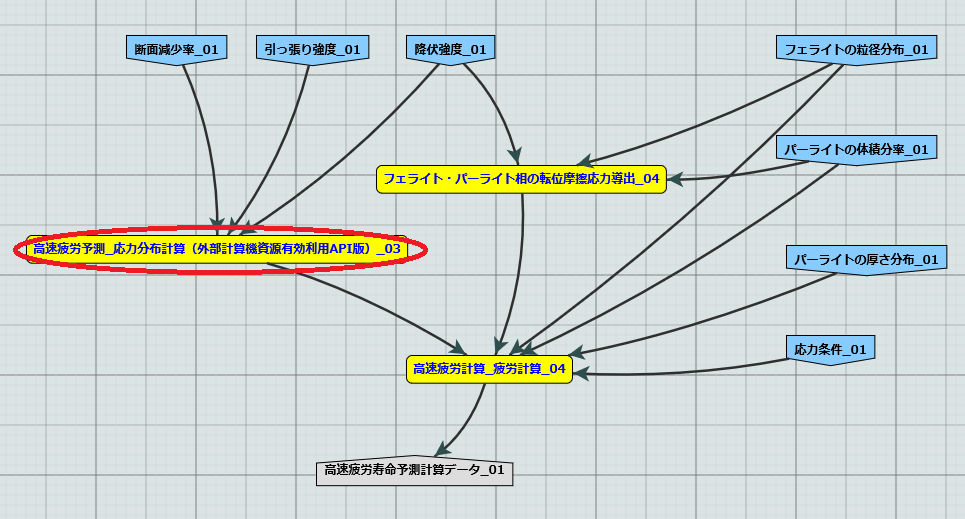

外部計算機資源の有効活用について
================================

概要
-----

MIシステムから任意のモジュールの計算をMIシステム外の計算機を使用してワークフローを実行することを外部計算機資源の有効活用としてSIP２期の検証項目として実装している。
本システムは２０１９年度の検証を踏まえ、より簡易に実装が可能なシステムとなっている。

* NIMS DMZに配置したMIntシステムを対象とする。

  + SSH等で外部の計算機と計算資源として計算を行う方法
  + 専用APIシステムを構築してSSH接続が不可能な外部の計算機を計算資源として利用する方法
* 外部計算機資源において、秘匿データなどの扱い

  + 秘匿データの指定は簡易な方法
  + MIntシステム側からはその存在は感知しない

本ドキュメントは外部計算機資源の有効活用について、説明し、次いで簡単にインストール、実行する方法を説明する。

扱う方式
-------------------

本書で扱う外部計算機資源の有効化強うの方法は以下の２つの形式である。

* sshなどでMIシステムの任意のモジュールから直接遠隔計算を実行する。
* WEBAPIを利用してMIシステムの任意のモジュールからポーリング形式で遠隔計算を実行させる。

SSHを利用した遠隔実行
=====================

最初にsshを利用して、MIシステムの任意のモジュールから外部計算機資源を利用する方法を説明する。

SSH実行のイメージ
------------------

この方式では、以下のようなシステムを想定している。

.. figure:: images/remote_execution_image.eps
  :scale: 70%
  :align: center

.. raw:: html

   

  遠隔実行のイメージ

このようにして、特定のモジュール（Abaqus2017）と特定の計算ノード（計算ノード２）を用意し、計算ノード２がMIシステム外にある計算機を遠隔実行できるように設定して、使用することでMIシステム外の計算機または計算機群をMIシステム内にあるかのごとく計算（ワークフロー）を実行することが可能になる。  

.. raw:: latex

    \newpage

詳細
-----------------

* MIntシステム側。
    + 遠隔実行専用の計算ノードを設置してある。
    + 遠隔実行用予測モジュールを作成。
    + このモジュールは専用計算ノードを指定して計算を行うよう設計。
    + モジュールおよび専用計算ノードにssh操作の設定。
* MIntシステム外（主に要件）
    + 外部から到達可能な場所。
    + 可能ならLinux（Macでも可能。Windowsはssh到達に問題があるため非推奨）。
    + 必要な資材を取得、展開。
    + 必要な情報を設定（主にソルバーパス、パラメータ、秘匿データの配置）

MInt側詳細
^^^^^^^^^^^

専用計算ノードでは以下のような動作が行われるように、専用モジュールが定義するプログラムを実行する。

必要な資材はgitlabに登録してある。

* パラメータ類の遠隔計算機へ送信（遠隔計算機側にあるパラメータまたはファイルを指定することも可）。
* 遠隔計算機でソルバー（プログラム）の実行。
* 実行が終了したら結果ファイルの取得。

外部計算機資源の詳細
^^^^^^^^^^^^^^^^^^^^

外部計算機資源側計算機では、必要なファイルの配置が主な手順である。

必要な資材はgithubに登録してある。

* 資材の展開
* ソルバーパスの調整
* 秘匿データ（ある場合）に指定のディレクトリへの配置

動作テストに使用したワークフロー
^^^^^^^^^^^^^^^^^^^^^^^^^^^^^^^^^

この方式では下記のようなイメージの動作検証環境用ワークフローを用意した。

.. figure:: images/workflow_with_sshmodule.png
  :scale: 80%
  :align: center

  動作検証用のワークフロー

※赤枠の部分が遠隔実行が行われるモジュールである。

APIを利用したポーリング方式
============================

続いてはAPI(MIntシステムのAPIではない)を利用したポーリング方式による実証例を取り上げる。sshなどで直接通信が行えない組織間でもhttpまたはhttpsでの通信は可能なことが多く、これを利用することで外部計算資源の有効活用できることを狙った。

概要
----

APIを利用したポーリングシステムとは外部計算資源をsshなどで直接操作するのではなく、中間に計算を仲介するAPIを立て、MIntシステム側、外部計算資源側がそのAPIを利用してhttpまたはhttps通信で計算の依頼、実行などを行うシステムである。
この場合、外部計算資源側、MIntシステム側（予測モジュール）は計算工程の随所で定期的に通信する必要がある（ポーリング）ので、ポーリングシステムと言う。
sshの場合と比べて外部計算資源の利用および実行のための手続きが多くなり、用意するプログラムも複雑になる。

システムの条件
---------------

この方式における必要な条件を記す。おもに外部計算資源側の条件となる。

* httpまたはhttps通信が可能な場所。
* ポーリング用プログラムと計算を行うプログラムを実装できる計算機。複数又は単一。複数の場合は相互に通信できること。
* 実行可能な計算またはプログラムは予め双方で決めておき、利用時に照合する。

.. raw:: latex

    \newpage

実行のイメージ
---------------

この方式では以下のようなシステムを想定している。 

.. figure:: images/remote_execution_image_api.eps
  :scale: 70%
  :align: center

.. raw:: html

   

  APIを利用した外部計算資源の利用イメージ

.. raw:: latex

    \newpage

ポーリングシステムのイメージ
----------------------------

この方式でのポーリングシステムのフロー概要。

.. mermaid::
   :caption: ポーリングシステムの流れ
   :align: center

   sequenceDiagram;

   participant A as MIシステム （NIMS内）
   participant B as WebAPI (NIMS内)
   participant C as ポーリングシステム （ユーザー側）
   participant D as ユーザープログラム （ユーザー側）

   C->>B:リクエスト
     alt 計算が存在しない
       B->>C:ありません
       C -->> C:リクエスト継続
     else 計算が存在する
       A->>B:計算要求
       C->>B:リクエスト
       B->>C:あります
       C->>B:情報取得リクエスト
       alt 計算実行
         B->>C:パラメータ送付、コマンドライン送付
         C->>D:プログラム実行
         alt プログラム実行
           D -->> D:プログラム実行中
         else プログラム終了
           D -->> C:プログラム終了
         end
         C->>B:計算終了通知
       else no seq
       end
       B->>C:計算結果の返却要求
       C->>B:計算結果の返却応答
       B->>A:ジョブの終了要求
     end

.. raw:: latex

    \newpage

動作テストに使用したワークフロー
-------------

下記イメージの動作検証用環境を用意しした。

   検証用ワークフロー

※赤枠の部分が外部計算機資源を利用するモジュールである。

.. raw:: latex

    \newpage

外部計算機でのディレクトリ
--------------------------

外部計算機のディレクトリ構造は以下のようになっている。インストール方法については後述する。

* ユーザーディレクトリ

.. code-block:: none
  
  ~/ユーザーディレクトリ
    + remote_workflow
      + scripts
        + input_data
    + misrc_distributed_computing_assist_api
      + debug
        + remote-side

MIntシステムへ送信されるデータ
------------------------------

SSH/APIどちらの方法を用いても、MIntシステムへ送り返されるデータは、以下の通り。

* あらかじめ予想される計算結果としての出力ファイル
* 計算実行中に標準出力、標準入力に出力されるいわゆる計算ログと言われるもの

※ 秘匿データを配置してあるディレクトリまたはインストール後のセットアップで実行に必要なファイル、データとして指定されたものはMIntシステムで感知できないこと、およびシステム的に記録（GPDBなど）するための設定がなされていないため送り返されることはありません。

使用方法
========

SSH方式
-------

API方式
-------

ワークフローの準備
------------------

秘匿データがある場合
--------------------
以上

