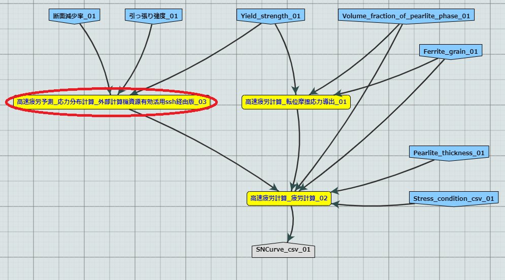

==========
はじめに
==========

MIntには、ワークフローを構成するモジュール内の一部分の処理を、MIntの計算ノード以外の「外部計算機」に行わせる機能がある。本機能によって、ユーザには下記に挙げる利点がある。

* 部外秘プログラムの使用
* 部外秘データの使用
* 特殊構成 (MIntの計算ノードでは対応できない) の計算機を使用できる
* 商用ソフトの使用 (MIntの計算ノードにも商用ソフトがインストールされているが、ライセンスの規定上、ほとんどの場合NIMS外からは利用できない)

外部計算資源の利用に際しては、MInt、外部計算機の双方が後述のセキュリティ水準を満たす必要がある。

1. 産学共同研究契約、MIntシステム利用規定、その他のMInt利用に関わる契約・規定の各条項を遵守すること。
2. MInt提供側は、下記のセキュリティ対策を実施すること。

    * 第三者によるMIntのセキュリティ分析・セキュリティリスク診断を実施し、リストを避ける設計を維持すること。
    * MIntを構成するサーバのOS・ミドルウェア・ライブラリ等に対し、継続的に脆弱性データベースを確認し、必要なアップデートを実施すること。
    * 不正アクセス監視やネットワーク負荷監視を実施すること。
3. 外部計算資源の提供側は、外部計算機として利用されるコンピュータに対し、十分なセキュリティ対策を実施すること。継続的に利用する場合には、定期的に対策状況を確認し、セキュリティレベルを維持すること。

外部計算資源利用には、SSH方式とWebAPI方式がある。
前者はMIntから外部計算機へSSHで必要なデータとコマンドをプッシュする方式である。
単純で、外部計算を遅延なく開始できる利点があるが、外部計算機側でMIntに対しSSHのポートを開放してプッシュを受け入れる必要がある点は、特に企業ユーザではハードルが高いことが想定される。
これに対し、後者は数分間隔で外部計算機側からMIntにWebAPI(https)でポーリングし、処理すべき案件が存在した場合は、必要なデータとコマンドがプルされる方式である。
この方式では外部計算機側にポート開放の必要が無いが、外部計算開始までにポーリング間隔に相当する遅延が生じる。

MIntが収集する情報はワークフローの各モジュールの入出力ポートの情報のみであるため、モジュールの内部で完結する本機能に関し、モジュールと外部計算機の間で送受信される情報は収集対象外である。

SSHでは.authorized_keysの設定で外部計算機がMIntに実行を認めるコマンドを固定できる。
WebAPI方式では、外部計算機は自分でコマンドを実行する。
また、もちろん外部計算が返却するデータは十分に限定することができる。

上記の機構によって安全な外部計算が保証される。下記の各章で、具体的な利用方法について記す。
また、外部計算資源の利用にあたって本書では不明な点は、ユーザとMInt運用チームとの協議のうえで決定するものとする。

.. raw:: latex

    \newpage
==========
概要
==========

処理の流れ
==========

外部計算資源利用時の処理の流れを下図に示す。

* MIntはNIMS構内のDMZ [#whatisDMZ]_ に存在する。
* ユーザはMInt上に、外部計算を利用するモジュールを含んだワークフローを持つ。当該モジュールやワークフローの参照・実行権限は自機関内などに限定できる。
* ユーザは当該ワークフローに必要な入力を与えて実行する。
* MIntはモジュールを順次実行する。
* 各モジュールは定義された処理を実行する。外部計算を利用するモジュールでは、一部の処理が外部計算機に受け渡される。
* 外部計算機は処理の過程で、MIntに置けないデータやプログラムにアクセスできる。これらへのアクセスを外部計算機での処理の中で完結させることで、安全な利用が可能となる。
* モジュールは外部計算機から返送された結果を受け取り、定義されていれば必要な後処理を行ってモジュールとしての出力を行う。
* MIntはワークフローの残りの部分を実行し、ユーザに最終結果を出力する。
.. raw:: html

   

  外部計算機資源の利用イメージ
  
.. figure:: images/image_for_use.eps
  :scale: 70%
  :align: center

  外部計算機資源の利用イメージ

.. [#whatisDMZ] 物理的にはNIMS構内のサーバ室に存在するが、ネットワーク的には機構内LANとインターネットの双方からファイアウォールで切り離された領域のこと。

SSH方式とWebAPI方式の比較
=======================

SSH方式とWebAPI方式では、下記のように外部計算機にアクセスされる。外部計算機側に必要なファイアウォールの解除条件についても、合わせて示す。

* SSH方式
    + MInt側からSSHで外部計算機にアクセスし、必要なファイルとコマンドをプッシュし、コマンドを発行し、結果を得る。
    + ファイルは内部でrsync -avを利用して送受信され、サイズは無制限である。
    + コマンドラインなどの文字列はBase64エンコード無しで送受信される。
    + 外部計算機側SSHサーバのポート(TCP/22以外でも可)のインバウンドアクセスの開放が必要である。
* WebAPI方式
    + 外部計算機側からMIntのAPIサーバにポーリングを行い、要処理案件の有無を確認する。ポーリング間隔は数分程度を想定している。案件があれば、外部計算機が必要なデータとコマンドをプルし、自らコマンドを実行し、APIで結果を送信する。
    + ファイルはBase64エンコードされ、サイズはエンコード後に2GiB未満である必要がある。
    + コマンドラインなどの文字列はBase64エンコード無しで送受信される。(★★ホント？)
    + MIntのAPIサーバへのhttps(TCP/443)のアウトバウンドアクセスの許可が必要である。

資材の入手
==========

外部計算資源の利用開始に必要な資材は、GitHub 上のリポジトリ [#whatisRepository]_ に用意されている。ユーザはこれらを外部計算機に配置し、プログラム実行に必要なコマンド、ファイル送受信の手続きを設定、埋め込むだけでよい。

- misrc_remote_workflow 

    - 主に外部計算機側で実行されるスクリプトのサンプルが登録されている。 
- misrc_distributed_computing_assist.api 

    - WebAPI方式のためのシステム構築用のプログラム、サンプルが登録されている。 
    - MIntシステム側で使用するプログラムは「debug/mi-system-side」にある。
    - 外部計算機側で使用するプログラムは「debug/remote-side」にある。 

リポジトリ上の資材に関しては、以下の制約を課すものとする。

1. 一部のファイル [#whatisOtherthanfiles]_ を除いてライセンスは「★★★」が適用され、ソースコードの著作権はMIntが保持する。
2. ユーザはダウンロードしたファイルを改変できるが、この改変によって外部計算機資源の有効利用のワークフローが動作しなくなってもMInt側(★★)は責任を追わない。
3. ユーザが改変したファイルの帰属は………… (★★)
3. 外部計算機資源側独自の改変を1. 以外のスクリプトに適用したい場合は、MInt(★★)と個別に協議する。

.. [#whatisRepository] 本機能を実現する資材などを格納したサーバのこと。GitHubを利用しているが、MIntがアカウントを発行したユーザのみダウンロードが可能である。アップロードはユーザには通常許可していない。
.. [#whatisOtherthanfiles] misrc_remote_workflow/scripts以下にある、SSH方式でのexecute_remote-side_program_ssh.sample.shを複製したファイルと、WebAPI方式でのexecute_remote-side_program_api.sample.shおよびこれらを複製したスクリプトファイルを指す。

ワークフローの廃止
----------------

本機能を利用したワークフローを廃止する際は、廃止届を提出する。廃止されたワークフローはMInt上で「無効」のステータスを付与され参照・実行不能となる。

=================
SSH方式での利用方法
=================

作業概要
=========

* MInt側

    + 外部計算専用の計算ノードの設置
    + 外部計算用モジュールの作成 (前項で用意した専用計算ノードを指定して実行可能)
    + モジュールおよび専用計算ノードのSSH設定(公開鍵認証を使い、パスフレーズ無しで接続できることが望ましい)
* 外部計算機側

    + Linux計算機の設置 (Macも可。WindowsはSSH接続に問題が生じやすいため非推奨だが動作は可能)
    + 必要資材の展開
    + 実行プログラムのパス・パラメータ・秘匿データの配置などの設定

処理概要
=========

* MInt側

    + パラメータ類を外部計算機へ送信（外部計算機側にあるパラメータまたはファイルの指定も可）
    + 外部計算機でプログラムの実行
    + 結果ファイルの取得
* 外部計算機側

    + リポジトリから取得した資材の展開
    + 実行プログラムパスの調整
    + 秘匿データ（ある場合）の指定ディレクトリへの配置

.. mermaid::
   :caption: SSH実行のイメージ
   :align: center

   graph LR;

   subgraph NIMS所外
     input3[\秘匿データ/]
     module21[専用プログラム実行]
     module22[データ返却]
   end
   subgraph MIntシステム
     subgraph ワークフロー
       input1[\入力/]
       module11[SSH実行開始]
       module12[SSHデータ受け取り]
       module13[計算]
       output1[/出力\]
     end
   end

   input1-->module11
   module11-->module12
   module12-->module13
   module13-->output1
   input3-->module21
   module11--SSH経由-->module21
   module21-->module22
   module22--SSH経由-->module12

サンプルワークフロー
------------------

下記のサンプルが用意されている。

.. figure:: images/remote_execution_image.eps
  :scale: 70%
  :align: center

  遠隔実行のイメージ

.. raw:: html

   

  遠隔実行のイメージ

モジュール(Abaqus2017)と、外部計算用の計算ノード(計算ノード２)を用意することで、外部計算資源を利用したワークフローが実行可能となる。またAbaqus2017と謳ってはいるが実行するプログラムはこれに限らず、様々なコマンド、プログラム、アプリケーションを実行することが可能なように作られている。

  動作検証用のワークフロー

※赤枠の部分が遠隔実行の行われるモジュールである。

.. raw:: latex

   \newpage
外部計算機でのディレクトリ構造
-----------------------

外部計算機のディレクトリ構造は下記の通りである。インストール方法は後述する。

* ユーザーディレクトリ

.. code-block:: none
  
  ~/ユーザーディレクトリ
    + remote_workflow
      + scripts
        + input_data

* ワーキングディレクトリ

.. code-block:: none

  /tmp/<uuid>

コマンドの流れ
--------------

ワークフローの該当モジュールから外部計算機のコマンドが実行されるまでの流れを下記に示す。

.. mermaid::
   :caption: SSH接続経由によるコマンド実行の流れ
   :align: center

   sequenceDiagram;

     participant A as モジュール
     participant B as プログラム（Ａ）
     participant C as プログラム（Ｂ）
     participant D as プログラム（Ｃ）
     participant E as プログラム（Ｄ）

     Note over A,C : NIMS機構内
     Note over D,E : 外部計算機資源内

     A->>B:モジュールが実行
     B->>C:（Ａ）が実行
     C->>D:（Ｂ）がSSH経由で外部計算機の（Ｃ）を実行
     D->>E:（Ｃ）が実行

* ワークフロー : 予測モジュール

    + MIntシステムが実行する予測モジュール
    + （Ａ）を実行する
* プログラム（Ａ）: kousoku_abaqus_ssh_version2.sh（サンプル用）

    + MIntの予測モジュールが実行する。
    + モジュールごとに用意する。名前は任意。:ref:`how_to_use` で説明する編集を行う。
    + モジュール定形の処理などを行い、（Ｂ）を実行する。
        - （Ｂ）の名前は固定である。
* プログラム（Ｂ）: execute_remote_command.sample.sh

    + （Ａ）から実行された後、外部計算機実行のための準備を行い、SSH経由で（Ｃ）を実行する。
    + 名前は固定である。このプログラムが外部計算機資源との通信を行う。
    + :ref:`how_to_use` で説明する編集を行う。
        - 送信するファイルはパラメータとして記述。
        - （Ｃ）の名前は固定である。
    + 受信するファイルは外部計算機資源上の計算用ディレクトリ [#calc_dir1]_ のファイル全部。
* プログラム（Ｃ）: execute_remote-side_program_ssh.sh

    + （Ｂ）からSSHで実行される。
    + 外部計算機で実行されるプログラムはここへシェルスクリプトとして記述する。
    + インストール時はexecute_remote-side_program_ssh.sample.sh [#sample_name1]_ となっている。
* プログラム（Ｄ）: remote-side_scripts
    + （Ｄ）から実行されるようになっており、いくつかのスクリプトを実行するよう構成されている。
    + サンプル専用であり、必ず使うものではない。（Ｃ）に依存する。

.. [#calc_dir1] 外部計算機では、計算は/tmpなどに作成した一時ディレクトリで実行される。
.. [#sample_name1] 本システムでは、MIntは「execute_remote_command.sample.sh」を実行し、外部計算機で実行を行うプログラムとして「execute_remote-side_program_ssh.sh」を呼び出す。外部計算機側ではインストール後にこのファイル（インストール直後は、execute_remote_program_ssh.sample.shと言う名前）を必要に応じて編集して使用することで、別なコマンドを記述することが可能になっている。

MIntへ送受信されるデータ
----------------------

MIntへ送受信されるデータは、「execute_remote_command.sample.sh」に記述しておく。

* MIntから外部計算機への送信

    + 「execute_remote_command.sample.sh」にパラメータとして記述したファイル。（モジュール内）
* 外部計算機からMIntへの返信

    + 計算結果としての出力ファイル。
        - 計算専用ディレクトリを作成して計算され、そのディレクトリ以下のファイルは全て (★★)
        - このディレクトリでの計算は、「execute_remote-side_program_ssh.sh」で行われるので、返信しないファイルはスクリプト終了前に削除されるようスクリプトを構成する。

.. raw:: latex

    \newpage

