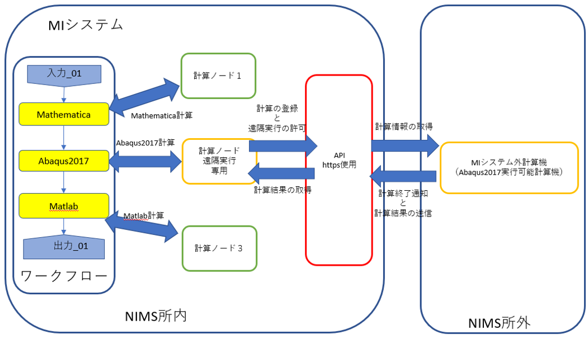
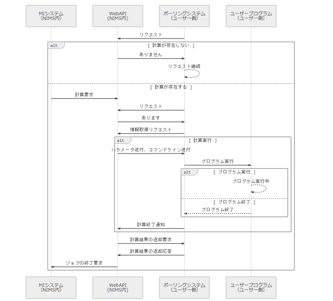

MIシステム遠隔実行
==================

MIシステムから一部のモジュールの計算をMIシステム外の計算機を使用してワークフローを実行するための情報を記述する。

※今回の実証は遠隔接続が可能な環境において行われた。遠隔接続の可不可については後述する。

概要
-----
企業がMIシステムを使用する場合に、以下のような問題が発生することが想定されている。

* 企業（または大学）が利用するソフトウェアのライセンスが企業（または大学）にしかない場合。
* 企業が持ち出しできないデータ・ツール（プログラム）をワークフローの中で使いたい場合。
* 企業（または大学）にある特定のハードウェア（スーパーコンピューター、大規模GPU計算環境など）を使いたい場合。

このような場合、MIシステム側から上記のような場所、または計算機（または計算機群）へ遠隔実行を行えることが求められる。
具体的には専用のモジュールと専用の計算機ノードを用意し、使用することで、これらの要求を満たすことが可能になる。
本書はこれらを実行するための実証実験のための情報を記述する。

遠隔実行のパターン
-------------------

本実証試験では以下の２つの事例について実証した。

* sshなどでMIシステムの任意のモジュールから直接遠隔計算を実行する。
* WEBAPIを利用してMIシステムの任意のモジュールからポーリング形式で遠隔計算を実行させる。

SSHを利用した遠隔実行
=====================

最初にsshを利用して、MIシステムの任意のモジュールから遠隔地にある計算機を利用した計算を行う例をとりあげる。

実証実験の条件
--------------

本事例における遠隔実行には可能な場合と不可能な場合がある、以下のような場合不可能である。

* MIシステムが設置されている組織から外部の組織へssh等の接続が理論的に遮断されている場合。
* 遠隔実行を行う計算機のある組織が外部からの接続を理論的に遮断している場合。

遠隔実行のイメージ
------------------

本事例では、以下のようなシステムを想定している。

.. figure:: images/remote_execution_image.png
  :scale: 70%
  :align: center

  遠隔実行のイメージ

このようにして、特定のモジュール（Abaqus2017）と特定の計算ノード（計算ノード２）を用意し、計算ノード２がMIシステム外にある計算機を遠隔実行できるように設定して、使用することでMIシステム外の計算機または計算機群をMIシステム内にあるかのごとく計算（ワークフロー）を実行することが可能になる。  

.. raw:: latex

    \newpage

遠隔実行の実際
-----------------

* MIシステム側。
    + 遠隔実行専用の計算ノードの設置を行った。
    + 遠隔実行用予測モジュールを作成した。
    + 同モジュールはこの計算ノードを指定して計算を行うよう設計された。
* MIシステム外（主に要件）
    + LAN到達可能な場所。
    + 可能ならLinux（MacまたはWindowsでも可能）。

検証内容
------------
専用計算ノードでは以下のような動作が行われるように、専用モジュールが定義するプログラムを実行する。

* パラメータ類の遠隔計算機へ送信（遠隔計算機側にあるパラメータまたはファイルを指定することも可）。
* 遠隔計算機でソルバー（プログラム）の実行。
* 実行が終了したら結果ファイルの取得。

動作検証
---------
本事例では下記のようなイメージの動作検証環境用ワークフローを用意した。

  動作検証用のワークフロー

※赤枠の部分が遠隔実行が行われるモジュールである。

検証結果
--------
動作検証環境を使用し、以下の検証を行い、すべて想定の動作を行ったことを確認した。

* 動作環境の赤枠のモジュールから遠隔計算機へプログラム実行の確認。
* 遠隔計算機上でワークフローのモジュールから遠隔プログラム実行の動作要求受付とその実行の確認。
* 遠隔計算機のプログラム終了後、計算結果のMIシステム上への取得とGPDB、アセット管理へのデータの格納および移行。

本格的な運用のために
--------------------
今は遠隔実行される計算機およびソルバーは特定の計算機、特定のソルバーだが、できる限り汎用的に使えるようにする工夫またはユーザーの要望を受けつける手法の整備などの対応策が必要である。その手法は今後の課題となる。今現在考えられるものをいかに挙げる。

* 既知のソルバーを遠隔実行できる汎用化された予測モデルおよびモジュールの準備。
* 遠隔実行に必要な準備のリスト化。
    + 遠隔実行に使う計算機の準備（ssh到達できるための準備など）
    + 接続方法の選択（パスワードなし、公開鍵認証、認証情報埋込式など）
    + 実行プログラム実行方法の取得
    
    
APIを利用したポーリング方式
============================

続いてはAPI(MIシステムのAPIではない)を利用したポーリング方式による実証例を取り上げる。sshなどで直接通信が行えない組織間でもhttpまたはhttpsでの通信は可能なことが多く、これを利用することで外部計算資源の利用が行える。

概要
----

ポーリングシステムとは外部計算資源をsshなどで直接操作するのではなく、中間に計算を仲介するAPIを立て、MIシステム側、外部計算資源側がそのAPIを利用してhttpまたはhttps通信で計算の依頼、実行を行うシステムを想定する。この場合、外部計算資源側は計算の有無を定期的に確認する必要がある（ポーリング）ので、ポーリングシステムと言う。sshの場合と比べて外部計算資源の利用のためのプログラム上の手続きが多くなり、用意するプログラムも複雑になる。

実証実験の条件
---------------

本事例における遠隔実行に必要な条件を記す。おもに外部計算資源側の条件となる。

* httpまたはhttps通信が可能な場所。
* ポーリング用プログラムと計算を行うプログラムを実装できる計算機。複数又は単一。複数の場合は相互に通信できること。
* 実行可能な計算またはプログラムは予め双方で決めておき、利用時に照合する。

.. raw:: latex

    \newpage

実行のイメージ
---------------

本事例では以下のようなシステムを想定している。 

  APIを利用した外部計算資源の利用イメージ

.. raw:: latex

    \newpage

ポーリングシステムのイメージ
----------------------------

本事例にあるポーリングシステムのフロー概要。

   ポーリングシステムの流れ

.. raw:: latex

    \newpage

遠隔実行の実際
---------------

本事例の実証は以下のような準備および設定を行った。
* MIシステム側API
  + 計算情報の仲介を行うAPIを作成した。
  + 本APIはこのシステムの要であり、計算情報の一元管理を行い、計算ノード、外部計算資源の両方からアクセスされる。
* MIシステム側計算ノード
  + 前回設置した外部計算資源利用専用の計算ノードを利用した
  + 本事例専用の外部計算資源利用専用の実行モジュールを作成した。
  + 同モジュールはAPIに計算の登録、状況の取得、計算結果の取得を行うように設計された。
* MIシステム外（外部計算資源側）
  + httpまたはhttps通信が可能な計算機の準備（前回と同じ所内ではあるが、MIシステムとは別な計算機を利用）
  + この計算機にポーリングシステムプログラムを実装した。
  + 用意した実証用ポーリングプログラムはpythonなのでプラットフォームは選ばない。

検証の内容
-----------

検証の内容として以下の項目を検証した。

* MIシステムが実行するモジュールプログラムからの計算上の登録
* 同、外部計算機側の状況の問い合わせの動作確認
* 外部計算資源側からポーリングに必要な各種問い合わせの動作確認
* パラメータ類が正常に送受信可能か
* 外部計算機側で計算終了後、登録した計算情報が想定どおり削除されるか。
* APIへ通知される各種ステータスが想定どおり変化するかの確認。
* 外部計算機側から送付された計算結果をMIシステム側のモジュールで受け取り、MIシステムの出力ファイルとして認識されているかの確認。
* 同時にGPDBへの登録が行われているかの確認（データ一覧での表示）

.. raw:: latex

    \newpage

動作検証
--------
下記イメージの動作検証用環境を用意しした。

   検証用ワークフロー

※赤枠の部分が外部計算機資源を利用するモジュールである。

.. raw:: latex

    \newpage

検証の様子
----------

デバッグ時の様子である。

   デバッグの様子

デバッグ時は外部計算機資源を利用するモジュールのみで動作させた。その時の様子である。
* 左上のターミナルがAPIの実行画面。
* 右下のウィンドウはAPIの内部状態の表示。
* 左下のウィンドウは外部計算機資源相当の計算機上で動作するポーリングシステムプログラムの動作状況。

検証結果
--------

動作検証結果を使用し、以下の検証を行いすべて想定の動作を行ったことを確認した。

* 動作環境の赤枠のモジュールからAPIへ計算情報の登録が行われた。
* 外部計算機資源相当の計算機からAPIへ計算情報の有無の問い合わせにより、登録した計算情報を取得し、計算が行われた。
* 外部計算機資源相当の計算機からAPIへ計算開始、修了、結果の送信、結果の送信終了のステータスが通知され、API内部のステータスも変化したことを確認した。
* 計算終了後、外部計算機資源相当の計算機から計算結果が送信されるのを確認した。
* 赤枠のモジュールで上記ステータスの変化を関知し、計算終了後に送信された計算結果を受信できることを確認した。
* すべての動作終了後、登録した計算情報は削除されるのを確認した。
* 一連の動作が各プログラム（赤枠のモジュールが実行する物を除く）の再起動なしに連続して処理できることを確認した。

考察と検討事項
--------------

本事例ではAPIの仕様として、外部計算機資源で実行できるプログラムおよび組織を特定する機能を実装した。通信路のセキュリティはhttps通信を使用すればこのレベルの検証および次の段階での使用には問題ないと考えられる。認証はMIシステムの認証機構を使用し、MIシステム利用ユーザーに発行されるAPIトークンを使用するようになっている。このほか以下のような検討事項があることが判明した。

* MIシステムの認証機構を利用する上で、現状送受信できるファイルサイズに限界がある。
  + メーカーは2Gバイトまでということだが、本検証では1.1Gバイトで送受信不可能だった。
  + この点は現在進行形で行われている改修を待つか、別な方法を模索する必要がある。

以上

